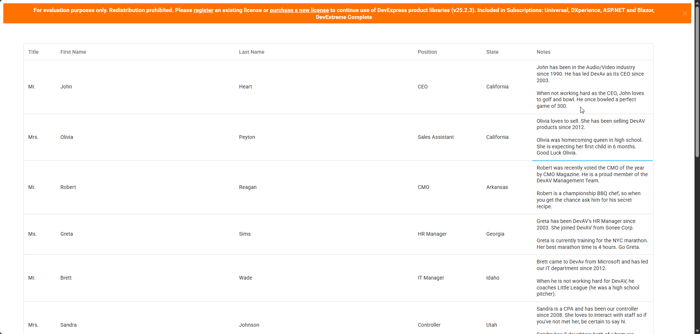

<!-- default badges list -->

[](https://supportcenter.devexpress.com/ticket/details/T1322816)
[](https://docs.devexpress.com/GeneralInformation/403183)
[](#does-this-example-address-your-development-requirementsobjectives)
<!-- default badges end -->
# DevExtreme DataGrid - Multiline Text Editing using DevExtreme TextArea

This example displays long string values as multiple rows of text within dxDataGrid cells. In edit mode, the DataGrid uses a TextArea as a cell editor.



## Implementation Details

To display long text within dxDataGrid cells, apply the following CSS styles to grid cell containers:

```css
tr.dx-data-row td {
	height: auto;
	white-space: pre-wrap;
	overflow-wrap: break-word;
}
```

This example applies multiline styles to the **Notes** column only.

Follow the steps below to use a DevExtreme TextArea as a cell editor:

1. Define the **dxDataGrid**.**columns[]**.[editCellTemplate](https://js.devexpress.com/Documentation/ApiReference/UI_Components/dxDataGrid/Configuration/columns/#editCellTemplate) and configure a TextArea component as needed. Enable the **dxTextArea**.[autoResizeEnabled](https://js.devexpress.com/Documentation/ApiReference/UI_Components/dxTextArea/Configuration/#autoResizeEnabled) option to avoid text truncation.

2. Apply the following CSS styles to ensure consistent cell appearance in edit mode:

    ```css
    .dx-editor-cell
        > .dx-textarea
        > div.dx-texteditor-container
        > div.dx-texteditor-input-container
        > textarea.dx-texteditor-input {
        line-height: 16px;
        padding: 10px 11px !important;
    }

    .dx-textarea > .dx-texteditor-container > .dx-texteditor-input-container {
        margin: 0 !important;
    }
    ```

> [!Note]
> - These styles are specific to the theme used in this example (Material Blue Light Compact). Update styles to ensure visual consistency in other themes.

3. In the **dxTextArea**.[onInput](https://js.devexpress.com/Documentation/ApiReference/UI_Components/dxTextArea/Configuration/#onInput) event handler, call the **dxDataGrid**.[updateDimensions()](https://js.devexpress.com/Documentation/ApiReference/UI_Components/dxDataGrid/Methods/#updateDimensions) method.

## Files to Review

- **Angular**
    - [app.component.html](Angular/src/app/app.component.html)
    - [app.component.ts](Angular/src/app/app.component.ts)
- **React**
    - [App.tsx](React/src/App.tsx)
    - [NotesTextAreaComponent.tsx](React/src/NotesTextAreaComponent.tsx)
- **Vue**
    - [App.vue](Vue/src/App.vue)
    - [Home.vue](Vue/src/components/HomeContent.vue)
    - [DataGridTextArea.vue](Vue/src/components/DataGridTextArea.vue)
    - [NotesTextAreaComponent.vue](Vue/src/components/NotesTextAreaComponent.vue)
- **jQuery**
    - [index.html](jQuery/src/index.html)
    - [index.js](jQuery/src/index.js)
- **ASP.NET Core**    
    - [Index.cshtml](ASP.NET%20Core/Views/Home/Index.cshtml)

## Documentation

- [DataGrid.columns.editCellTemplate](https://js.devexpress.com/Documentation/ApiReference/UI_Components/dxDataGrid/Configuration/columns/#cellTemplate)
- [DataGrid.columns.cellTemplate](https://js.devexpress.com/Documentation/ApiReference/UI_Components/dxDataGrid/Configuration/columns/#editCellTemplate)
- [DataGrid.updateDimensions()](https://js.devexpress.com/Documentation/ApiReference/UI_Components/dxDataGrid/Methods/#updateDimensions)
- [TextArea.autoResizeEnabled](https://js.devexpress.com/Documentation/ApiReference/UI_Components/dxTextArea/Configuration/#autoResizeEnabled)
- [TextArea.onInput](https://js.devexpress.com/Documentation/ApiReference/UI_Components/dxTextArea/Configuration/#onInput)

<!-- feedback -->
## Does This Example Address Your Development Requirements/Objectives?

[](https://www.devexpress.com/support/examples/survey.xml?utm_source=github&utm_campaign=devextreme-datagrid-inline-editing-textarea&~~~was_helpful=yes) [](https://www.devexpress.com/support/examples/survey.xml?utm_source=github&utm_campaign=devextreme-datagrid-inline-editing-textarea&~~~was_helpful=no)

(you will be redirected to DevExpress.com to submit your response)
<!-- feedback end -->
